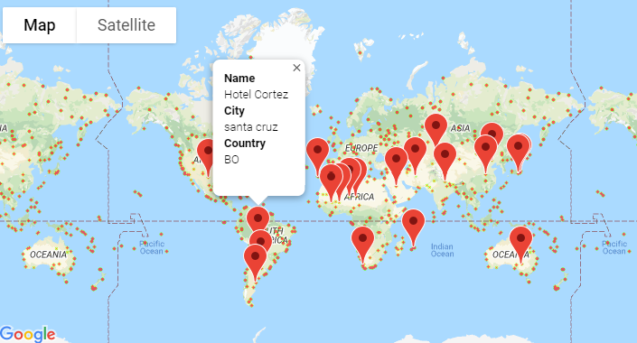

# python-api-challenge
Using APIs within Jupyter Notebook, Pandas, and Python framework to quantitatively answer questions about global weather patterns.

# Part I - WeatherPy
In this activity, I generated 500+ random cities from latitude and longitude from across the world with varying distance from the equator. To accomplish this, I used the Python library **citipy**, **OpenWeatherMap Api**, **Matplotlib**, **Jupyter Notebook**, and **Pandas** to create a representative model of weather in across world cities. 

First, scatter plots were made to elucidate the following relationships:
- Temperature (F) vs Latitude
- Humidity (%) vs Latitude
- Cloudiness (%) vs Latitude
- Wind Speed (mph) vs Latitude

Next, linear regression models were applied to the relationships, this time separating them into Northern Hemisphere and Southern Hemisphere. 
(In the Northern Hemisphere, latitude is greater than or equal to 0, and in the Southern Hemisphere, the latitude is below 0)
- Northern Hemisphere - Temperature (F) vs. Latitude
- Southern Hemisphere - Temperature (F) vs. Latitude
- Northern Hemisphere - Humidity (%) vs. Latitude
- Southern Hemisphere - Humidity (%) vs. Latitude
- Northern Hemisphere - Cloudiness (%) vs. Latitude
- Southern Hemisphere - Cloudiness (%) vs. Latitude
- Northern Hemisphere - Wind Speed (mph) vs. Latitude
- Southern Hemisphere - Wind Speed (mph) vs. Latitude
All in all, this activity accomplishes the following requirements:
- Randomly select at least 500 unique cities based on latitude and longitude
- Perform a weather check on each of the cities using successive API calls
- Include a print log of each city as its being processed with the city number and city name
- Save a CSV of retrived data and PNG image for each scatter plot for the **Outputs** folder

# Part 2 - VacationPy
Working with weather data again, this activity uses **Jupyter - gmaps** and **Google Places API** to generate maps based on the CSV data saved in the previous activity.
- First, I made a heat map that displays the humidity for every city
- Next, I narrowed the DataFrame down to a specific weather condition:
    - Temperautre less than 80 degrees
    - Cloudiness (%) less than or equal to 60
    - Humidity (%) less than 50
    - Wind Speed (mph) greater than or equal to 5 mph
- Use the Google Places API to find the first hotel for each city located within 5000 meters of your coordinates
- Plot the hotels on top of the humidity heatmap with each pin containing **Hotel Name**, **City** and **Country**
